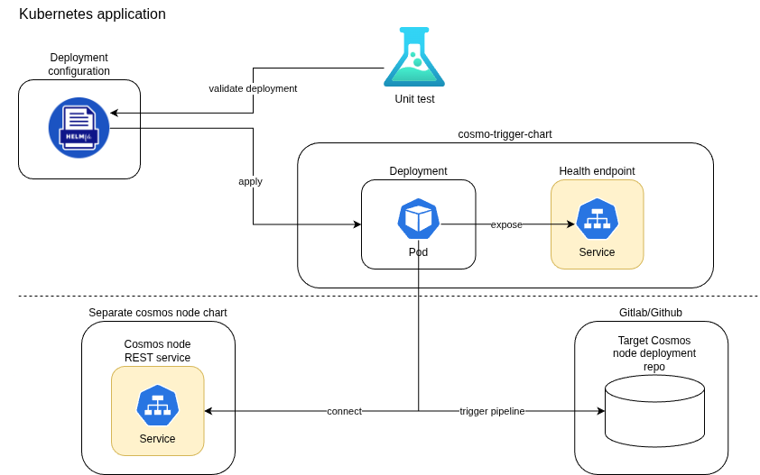

<h1 align="center" style="border-bottom: none">
    <br>CosmoTrigger chart
</h1>

The CosmoTrigger chart is a Helm chart used for deploying [CosmoTrigger](https://github.com/telekom-mms/cosmo-trigger)
in K8s. Please find all application relevant information in the respective repository.

## Requirements

[See configuration variables.](#custom-cosmo-trigger-configuration-via-env-vars--secrets)

## Architecture



## Usage

This chart is not supposed to be deployed with the default values contained
in the `values.yaml`. Please adapt accordingly.

### Using Helmfile

[Helmfile](https://github.com/helmfile/helmfile)
is a declarative spec for deploying Helm Charts.
It can be used to simplify the commands for rendering and deploying the Helm Chart.

```yaml
---
repositories:
  - name: "cosmo-trigger"
    url: "https://telekom-mms.github.io/web3-helm-charts"

releases:
  - name: "cosmo-trigger"
    chart: "cosmo-trigger/cosmo-trigger"
    version: "1.0.0"
    namespace: "cosmos"
    values:
      - "./values.yaml"
...
```

### Generating Docs for values.yaml

To generate the parameters of `values.yaml`, this project is using [bitnami/readme-generator-for-helm](https://github.com/bitnami/readme-generator-for-helm)

```shell
npm install -g @bitnami/readme-generator-for-helm
readme-generator --readme README.md --values values.yaml
```

## Configuration

The following table lists the configurable parameters of the
`cosmo-trigger` chart and their default values.

<!-- markdownlint-disable MD013 -->

## Parameters

### Global parameters (inherited from bitnami/common)

| Name               | Description                  | Value |
| ------------------ | ---------------------------- | ----- |
| `nameOverride`     | The name of the release      | `""`  |
| `fullnameOverride` | The full name of the release | `""`  |

### Image parameters

| Name               | Description                         | Value          |
| ------------------ | ----------------------------------- | -------------- |
| `image.registry`   | The Docker registry for the image   | `""`           |
| `image.repository` | The Docker repository for the image | `""`           |
| `image.tag`        | The Docker image tag                | `1.0.0`        |
| `image.pullPolicy` | The image pull policy               | `IfNotPresent` |

### Deployment parameters

| Name                           | Description                                                      | Value           |
| ------------------------------ | ---------------------------------------------------------------- | --------------- |
| `replicaCount`                 | The number of replicas                                           | `1`             |
| `updateStrategy.type`          | The update strategy type of the StatefulSet / Deployment         | `RollingUpdate` |
| `updateStrategy.rollingUpdate` | The rolling update configuration of the StatefulSet / Deployment | `{}`            |

### Image pull secrets

| Name               | Description                                            | Value |
| ------------------ | ------------------------------------------------------ | ----- |
| `imagePullSecrets` | The secrets for pulling images from a private registry | `[]`  |

### Resource parameters

| Name                        | Description              | Value   |
| --------------------------- | ------------------------ | ------- |
| `resources.requests.cpu`    | CPU resource requests    | `100m`  |
| `resources.requests.memory` | Memory resource requests | `250Mi` |
| `resources.limits.cpu`      | CPU resource limits      | `250m`  |
| `resources.limits.memory`   | Memory resource limits   | `250Mi` |

### Service parameters

| Name                         | Description                          | Value   |
| ---------------------------- | ------------------------------------ | ------- |
| `service.enabled`            | Enable or disable the service        | `true`  |
| `service.port`               | The port of the service              | `8080`  |
| `service.annotations`        | Annotations for the service          | `{}`    |
| `service.keepResourcePolicy` | Keep resource policy for the service | `false` |

### Affinity parameters

| Name       | Description                 | Value |
| ---------- | --------------------------- | ----- |
| `affinity` | Affinity for pod assignment | `{}`  |

### Node selector parameters

| Name           | Description                    | Value |
| -------------- | ------------------------------ | ----- |
| `nodeSelector` | Node labels for pod assignment | `{}`  |

### Tolerations parameters

| Name          | Description                    | Value |
| ------------- | ------------------------------ | ----- |
| `tolerations` | Tolerations for pod assignment | `{}`  |

### Security context parameters

| Name                                  | Description                                         | Value            |
| ------------------------------------- | --------------------------------------------------- | ---------------- |
| `securityContext.runAsNonRoot`        | Run containers as non-root user                     | `true`           |
| `securityContext.runAsUser`           | User ID to run the container                        | `1001`           |
| `securityContext.runAsGroup`          | Group ID to run the container                       | `1001`           |
| `securityContext.fsGroup`             | Group ID for the filesystem                         | `1001`           |
| `securityContext.seccompProfile.type` | Seccomp profile for the container                   | `RuntimeDefault` |
| `securityContext.seLinuxOptions`      | Optional SELinux options for SELinux-enabled nodes. | `{}`             |

### Container Security Context parameters

| Name                                                | Description                          | Value     |
| --------------------------------------------------- | ------------------------------------ | --------- |
| `containerSecurityContext.allowPrivilegeEscalation` | Allow privilege escalation           | `false`   |
| `containerSecurityContext.capabilities.drop`        | Drop all default capabilities        | `["ALL"]` |
| `containerSecurityContext.capabilities.add`         | Add specific capabilities            | `[]`      |
| `containerSecurityContext.readOnlyRootFilesystem`   | Set the root filesystem to read-only | `true`    |

### Topology Spread Constraints parameters

| Name                        | Description                     | Value |
| --------------------------- | ------------------------------- | ----- |
| `topologySpreadConstraints` | Pod Topology Spread Constraints | `[]`  |

### Readiness Probe parameters

| Name                                 | Description                                                              | Value    |
| ------------------------------------ | ------------------------------------------------------------------------ | -------- |
| `readinessProbe.enabled`             | Enable readiness probe                                                   | `true`   |
| `readinessProbe.httpGet.path`        | HTTP path for readiness probe                                            | `/ready` |
| `readinessProbe.httpGet.port`        | Port for the readiness probe which should be the same as the server port | `8080`   |
| `readinessProbe.initialDelaySeconds` | Initial delay for readiness probe                                        | `5`      |
| `readinessProbe.timeoutSeconds`      | Timeout for readiness probe                                              | `2`      |
| `readinessProbe.periodSeconds`       | Period for readiness probe                                               | `10`     |
| `readinessProbe.successThreshold`    | Success threshold for readiness probe                                    | `1`      |
| `readinessProbe.failureThreshold`    | Failure threshold for readiness probe                                    | `3`      |
| `customReadinessProbe`               | Custom readiness probe overwriting the default readiness probe           | `{}`     |

### Termination parameters

| Name                            | Description                         | Value |
| ------------------------------- | ----------------------------------- | ----- |
| `terminationGracePeriodSeconds` | Termination grace period in seconds | `10`  |

### Diagnostic mode parameters

| Name                     | Description                                                       | Value   |
| ------------------------ | ----------------------------------------------------------------- | ------- |
| `diagnosticMode.enabled` | Enable diagnostic mode (container starts without running process) | `false` |

### Extra parameters

| Name          | Description                                            | Value |
| ------------- | ------------------------------------------------------ | ----- |
| `extraLabels` | Additional labels to add to the Statefulset/Deployment | `{}`  |
| `extraArgs`   | Extra arguments to pass to the container arguments     | `[]`  |

### Priority parameters

| Name                | Description                      | Value |
| ------------------- | -------------------------------- | ----- |
| `priorityClassName` | Priority class name for the pods | `""`  |

### Custom cosmo-trigger configuration via env vars / secrets

| Name                                 | Description                                                                           | Value  |
| ------------------------------------ | ------------------------------------------------------------------------------------- | ------ |
| `env.APPLICATION_PORT`               | The port on which the application listens                                             | `8000` |
| `env.POLL_INTERVAL_MS`               | The interval at which to poll for updates                                             | `2000` |
| `env.COSMOS_NODE_REST_URL`           | The URL of the Cosmos node REST API (Required)                                        | `""`   |
| `env.CICD_REPOSITORY_BRANCH`         | The branch of the git repository from which to trigger the update pipeline (Required) | `main` |
| `env.CICD_PROJECT_API_URL`           | The API URL for the git repo/project (Required)                                       | `""`   |
| `env.CICD_VARIABLES`                 | Additional variables to pass to the CICD pipeline (Optional)                          | `{}`   |
| `envSecrets.cicdTriggerToken`        | The to trigger a CICD pipeline (Required)                                             | `""`   |
| `envSecrets.cicdPersonalAccessToken` | Personal access token for the git repository (Required)                               | `""`   |
| `extraEnvVars`                       | Extra environment variables to be passed to the container                             | `{}`   |

## Unit Tests

This Helm Chart contains unit tests which can be executed with [helm-unittest](https://github.com/helm-unittest/helm-unittest).

```shell
helm plugin install https://github.com/helm-unittest/helm-unittest.git
helm unittest .
```

## Contributing

Contributions are welcome! Please open an issue or submit a pull request on GitHub.

## License

This project is licensed under the Apache 2.0 License -
see the [LICENSE](LICENSE) file for details.

<!-- markdownlint-enable MD013 -->
