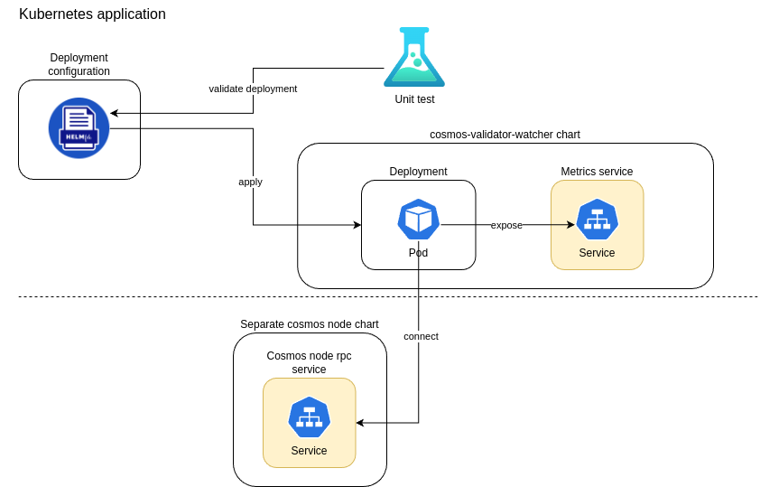

# cosmos-validator-watcher-chart

cosmos-validator-watcher-chart is a Helm chart used for deploying the
[cosmos-validator-watcher](https://github.com/kilnfi/cosmos-validator-watcher)
in K8s.

## Requirements

* [prometheus operator](https://github.com/prometheus-operator) or
* [kube-prometheus](https://github.com/prometheus-operator/kube-prometheus)
as fullstack solution

## Architecture



## Usage

This chart is not supposed to be deployed with the default values contained
in the `values.yaml`. Please adapt accordingly.

### Using Helmfile

[Helmfile](https://github.com/helmfile/helmfile)
is a declarative spec for deploying Helm Charts.
It can be used to simplify the commands for rendering and deploying the Helm Chart.

```yaml
---
repositories:
  - name: "cosmos-validator-watcher"
    url: "https://telekom-mms.github.io/web3-helm-charts"

releases:
  - name: "cosmos-validator-watcher"
    chart: "cosmos-validator-watcher/cosmos-validator-watcher"
    version: "1.0.0"
    namespace: "cosmos"
    values:
      - "./values.yaml"
...
```

### Generating Docs for values.yaml

To generate the parameters of `values.yaml`, this project is using [bitnami/readme-generator-for-helm](https://github.com/bitnami/readme-generator-for-helm)

```shell
npm install -g @bitnami/readme-generator-for-helm
readme-generator --readme README.md --values values.yaml
```

## Configuration

The following table lists the configurable parameters of the
`cosmos-validator-watcher` and their default values.

<!-- markdownlint-disable MD013 -->

## Parameters

### Global parameters (inherited from bitnami/common)

| Name               | Description                  | Value |
| ------------------ | ---------------------------- | ----- |
| `nameOverride`     | The name of the release      | `""`  |
| `fullnameOverride` | The full name of the release | `""`  |

### Image parameters

| Name               | Description                         | Value                             |
| ------------------ | ----------------------------------- | --------------------------------- |
| `image.registry`   | The Docker registry for the image   | `ghcr.io`                         |
| `image.repository` | The Docker repository for the image | `kilnfi/cosmos-validator-watcher` |
| `image.tag`        | The Docker image tag                | `v0.16.0`                         |
| `image.pullPolicy` | The image pull policy               | `IfNotPresent`                    |

### Deployment parameters

| Name                           | Description                                                      | Value           |
| ------------------------------ | ---------------------------------------------------------------- | --------------- |
| `replicaCount`                 | The number of replicas                                           | `1`             |
| `updateStrategy.type`          | The update strategy type of the StatefulSet / Deployment         | `RollingUpdate` |
| `updateStrategy.rollingUpdate` | The rolling update configuration of the StatefulSet / Deployment | `{}`            |

### Image pull secrets

| Name               | Description                                            | Value |
| ------------------ | ------------------------------------------------------ | ----- |
| `imagePullSecrets` | The secrets for pulling images from a private registry | `[]`  |

### Resource parameters

| Name                        | Description              | Value   |
| --------------------------- | ------------------------ | ------- |
| `resources.requests.cpu`    | CPU resource requests    | `50m`   |
| `resources.requests.memory` | Memory resource requests | `100Mi` |
| `resources.limits.cpu`      | CPU resource limits      | `50m`   |
| `resources.limits.memory`   | Memory resource limits   | `100Mi` |

### Service parameters

| Name           | Description             | Value  |
| -------------- | ----------------------- | ------ |
| `service.port` | The port of the service | `8080` |

### Affinity parameters

| Name       | Description                 | Value |
| ---------- | --------------------------- | ----- |
| `affinity` | Affinity for pod assignment | `{}`  |

### Node selector parameters

| Name           | Description                    | Value |
| -------------- | ------------------------------ | ----- |
| `nodeSelector` | Node labels for pod assignment | `{}`  |

### Tolerations parameters

| Name          | Description                    | Value |
| ------------- | ------------------------------ | ----- |
| `tolerations` | Tolerations for pod assignment | `{}`  |

### Security context parameters

| Name                                        | Description                          | Value  |
| ------------------------------------------- | ------------------------------------ | ------ |
| `podSecurityContext.readOnlyRootFilesystem` | Set the root filesystem to read-only | `true` |
| `securityContext.runAsNonRoot`              | Run containers as non-root user      | `true` |
| `securityContext.runAsUser`                 | User ID to run the container         | `1000` |
| `securityContext.runAsGroup`                | Group ID to run the container        | `1000` |

### Topology Spread Constraints parameters

| Name                        | Description                     | Value |
| --------------------------- | ------------------------------- | ----- |
| `topologySpreadConstraints` | Pod Topology Spread Constraints | `[]`  |

### Probe parameters

| Name                                 | Description                                                              | Value    |
| ------------------------------------ | ------------------------------------------------------------------------ | -------- |
| `startupProbe.enabled`               | Enable startup probe                                                     | `false`  |
| `startupProbe.initialDelaySeconds`   | Initial delay for startup probe                                          | `5`      |
| `startupProbe.timeoutSeconds`        | Timeout for startup probe                                                | `1`      |
| `startupProbe.periodSeconds`         | Period for startup probe                                                 | `20`     |
| `startupProbe.successThreshold`      | Success threshold for startup probe                                      | `1`      |
| `startupProbe.failureThreshold`      | Failure threshold for startup probe                                      | `10`     |
| `customStartupProbe`                 | Custom startup probe overwriting the default startup probe               | `{}`     |
| `livenessProbe.enabled`              | Enable liveness probe                                                    | `true`   |
| `livenessProbe.initialDelaySeconds`  | Initial delay for liveness probe                                         | `10`     |
| `livenessProbe.periodSeconds`        | Period for liveness probe                                                | `20`     |
| `livenessProbe.timeoutSeconds`       | Timeout for liveness probe                                               | `5`      |
| `livenessProbe.successThreshold`     | Success threshold for liveness probe                                     | `1`      |
| `livenessProbe.failureThreshold`     | Failure threshold for liveness probe                                     | `3`      |
| `livenessProbe.httpGet.path`         | HTTP path for liveness probe                                             | `/live`  |
| `livenessProbe.httpGet.port`         | Port for the liveness probe which should be the same as the server port  | `8080`   |
| `customLivenessProbe`                | Custom liveness probe overwriting the default liveness probe             | `{}`     |
| `readinessProbe.enabled`             | Enable readiness probe                                                   | `true`   |
| `readinessProbe.initialDelaySeconds` | Initial delay for readiness probe                                        | `5`      |
| `readinessProbe.periodSeconds`       | Period for readiness probe                                               | `20`     |
| `readinessProbe.timeoutSeconds`      | Timeout for readiness probe                                              | `1`      |
| `readinessProbe.successThreshold`    | Success threshold for readiness probe                                    | `1`      |
| `readinessProbe.failureThreshold`    | Failure threshold for readiness probe                                    | `5`      |
| `readinessProbe.httpGet.path`        | HTTP path for readiness probe                                            | `/ready` |
| `readinessProbe.httpGet.port`        | Port for the readiness probe which should be the same as the server port | `8080`   |
| `customReadinessProbe`               | Custom readiness probe overwriting the default readiness probe           | `{}`     |

### Termination parameters

| Name                            | Description                         | Value |
| ------------------------------- | ----------------------------------- | ----- |
| `terminationGracePeriodSeconds` | Termination grace period in seconds | `30`  |

### Diagnostic mode parameters

| Name                     | Description                                                       | Value   |
| ------------------------ | ----------------------------------------------------------------- | ------- |
| `diagnosticMode.enabled` | Enable diagnostic mode (container starts without running process) | `false` |

### Extra parameters

| Name          | Description                                            | Value |
| ------------- | ------------------------------------------------------ | ----- |
| `extraLabels` | Additional labels to add to the Statefulset/Deployment | `{}`  |
| `extraArgs`   | Extra arguments to pass to the container arguments     | `[]`  |

### Priority parameters

| Name                | Description                      | Value |
| ------------------- | -------------------------------- | ----- |
| `priorityClassName` | Priority class name for the pods | `""`  |

### Custom validator-watcher configuration

| Name                  | Description                                          | Value     |
| --------------------- | ---------------------------------------------------- | --------- |
| `server.httpAddr`     | The HTTP listening address of the application server | `0.0.0.0` |
| `server.port`         | The port of the application server                   | `8080`    |
| `nodeUrls`            | The list of node URLs to connect                     | `[]`      |
| `validator`           | The list of validators to watch                      | `[]`      |
| `noUpgrade`           | Disable check for upcoming upgrade                   | `false`   |
| `prometheusNamespace` | The namespace for Prometheus metrics                 | `""`      |
| `logLevel`            | The log level for the application                    | `info`    |

## Unit Tests

This Helm Chart contains unit tests which can be executed with [helm-unittest](https://github.com/helm-unittest/helm-unittest).

```shell
helm plugin install https://github.com/helm-unittest/helm-unittest.git
helm unittest .
```

## Contributing

Contributions are welcome! Please open an issue or submit a pull request on GitHub.

## License

This project is licensed under the Apache 2.0 License -
see the [LICENSE](LICENSE) file for details.

<!-- markdownlint-enable MD013 -->
