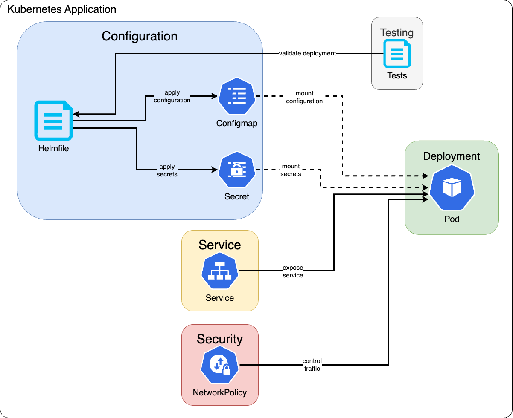

# layer-zero-chart

layer-zero-chart is the Helm Chart used for deploying [gasolina](https://github.com/LayerZero-Labs/gasolina).

## Architecture



## Usage

This chart is not supposed to be deployed
with the default values contained in the `values.yaml`.

### Using Helmfile

[Helmfile](https://github.com/helmfile/helmfile)
is a declarative spec for deploying Helm Charts.
It can be used to simplify the commands for rendering and deploying the Helm Chart.

```yaml
---
repositories:
  - name: "layer-zero"
    url: "https://telekom-mms.github.io/web3-helm-charts"

releases:
  - name: "layer-zero"
    chart: "layer-zero/layer-zero"
    version: "1.1.0"
    namespace: "layer-zero"
    values:
      - "./values.yaml"
      - wallets: {{ requiredEnv "WALLETS" | b64dec | quote }}
      <!-- markdownlint-disable MD013 -->
      - walletMnemonicMapping: {{ requiredEnv "WALLET_MNEMONIC_MAPPING" | b64dec | quote }}
      <!-- markdownlint-enable MD013 -->
...
```

### Installing the Chart

To install the chart with the release name `my-release`:

```shell
helm repo add my-repo https://my-repo-url
helm install my-release my-repo/layer-zero-chart
```

### Uninstalling the Chart

To uninstall/delete the `my-release` deployment:

```shell
helm uninstall my-release
```

### Upgrading the Chart

To upgrade the `my-release` deployment:

```shell
helm upgrade my-release my-repo/layer-zero-chart
```

### Generating Docs for values.yaml

To generate the parameters of `values.yaml`, this project is using [bitnami/readme-generator-for-helm](https://github.com/bitnami/readme-generator-for-helm)

```shell
npm install -g @bitnami/readme-generator-for-helm
readme-generator --readme README.md --values values.yaml
```

## Helm Deployment with Encoded Wallet and Mnemonic Values

To deploy Helm charts using Helmfile,
you must pass the values for `WALLETS` and `WALLET_MNEMONIC_MAPPING`
as Base64-encoded strings. The following steps outline the updated process:

### Step 1: Create JSON Strings for Values

Create JSON strings for the wallet values and
mnemonic mappings in the following formats:

#### Wallets

> `"secretName": "dont care"` can't be changed, according to the Layer Zero Foundation.

```json
[
    {
        "name": "my-wallet",
        "byChainType": {
            "EVM": {
                "address": "<WALLET_ADDRESS>",
                "secretName": "dont care"
            }
        }
    }
]
```

#### Wallets Mnemonics

> `"path": "m/44'/60'/0'/0/0"` is a derivation path.

```json
{
    "my-wallet-EVM": {
        "mnemonic": "<WALLET_MNEMONIC>",
        "path": "m/44'/60'/0'/0/0"
    },
    "my-wallet-SOLANA": {
        "mnemonic": "<WALLET_MNEMONIC>",
        "path": "m/44'/501'/1'/0'"
    }
}
```

### Step 2: Convert JSON Strings to Base64

Convert these JSON strings to Base64-encoded strings using the following commands:

<!-- markdownlint-disable MD013 -->
```bash
echo -n '[{"name":"my-wallet","byChainType":{"EVM":{"address":"<WALLET_ADDRESS>","secretName":"dont care"}}}]' | base64
```
<!-- markdownlint-enable MD013 -->

This command outputs the Base64-encoded string for the wallet values:

```bash
W3sibmFtZSI6Im15LXdhbGxldCIsImJ5Q2hhaW5UeXBlIjp7IkVWTSI6eyJhZGRyZXNzIjoiPFdBTExFVF9BRERSRVNTPiIsInNlY3JldE5hbWUiOiJkb250IGNhcmUifX19XQ==
```

And for the mnemonic mappings:

<!-- markdownlint-disable MD013 -->
```bash
echo -n "{\"my-wallet-EVM\":{\"mnemonic\":\"<WALLET_MNEMONIC>\",\"path\":\"m/44'/60'/0'/0/0\"},\"my-wallet-SOLANA\":{\"mnemonic\":\"<WALLET_MNEMONIC>\",\"path\":\"m/44'/501'/1'/0'\"}}" | base64
```
<!-- markdownlint-enable MD013 -->

This command outputs the Base64-encoded string for the mnemonic mappings:

```bash
eyJteS13YWxsZXQtRVZNIjp7Im1uZW1vbmljIjoiPFdBTExFVF9NTkVNT05JQz4iLCJwYXRoIjoibS80NCcvNjAnLzAnLzAvMCJ9LCJteS13YWxsZXQtU09MQU5BIjp7Im1uZW1vbmljIjoiPFdBTExFVF9NTkVNT05JQz4iLCJwYXRoIjoibS80NCcvNTAxJy8xJy8wJyJ9fQ==
```

### Step 3: Set Environment Variables

Set these Base64-encoded strings as environment variables:

```bash
export W3sibmFtZSI6Im15LXdhbGxldCIsImJ5Q2hhaW5UeXBlIjp7IkVWTSI6eyJhZGRyZXNzIjoiPFdBTExFVF9BRERSRVNTPiIsInNlY3JldE5hbWUiOiJkb250IGNhcmUifX19XQ==
export eyJteS13YWxsZXQtRVZNIjp7Im1uZW1vbmljIjoiPFdBTExFVF9NTkVNT05JQz4iLCJwYXRoIjoibS80NCcvNjAnLzAnLzAvMCJ9LCJteS13YWxsZXQtU09MQU5BIjp7Im1uZW1vbmljIjoiPFdBTExFVF9NTkVNT05JQz4iLCJwYXRoIjoibS80NCcvNTAxJy8xJy8wJyJ9fQ==
```

### Step 4: Run Helmfile Command

Run the Helmfile command:

```bash
helmfile apply
```

This command deploys the Helm chart with the provided values for `WALLETS` and `WALLET_MNEMONIC_MAPPING`.

Note that the `requiredEnv` function in Helmfile checks for the
presence of these environment variables and only deploys if they are set.
If you do not set the values for `WALLETS` and
`WALLET_MNEMONIC_MAPPING` as environment variables, the deployment process
will be aborted.

### Alternative Deployment Method

To deploy the Helm chart without using Helmfile, you can set the
values for `WALLETS` and `WALLET_MNEMONIC_MAPPING` as environment
variables and then run the Helm install command:

```bash
export WALLETS='W3sibmFtZSI6Im15LXdhbGxldCIsImJ5Q2hhaW5UeXBlIjp7IkVWTSI6eyJhZGRyZXNzIjoiPFdBTExFVF9BRERSRVNTPiIsInNlY3JldE5hbWUiOiJkb250IGNhcmUifX19XQ=='
export WALLET_MNEMONIC_MAPPING='eyJteS13YWxsZXQtRVZNIjp7Im1uZW1vbmljIjoiPFdBTExFVF9NTkVNT05JQz4iLCJwYXRoIjoibS80NCcvNjAnLzAnLzAvMCJ9LCJteS13YWxsZXQtU09MQU5BIjp7Im1uZW1vbmljIjoiPFdBTExFVF9NTkVNT05JQz4iLCJwYXRoIjoibS80NCcvNTAxJy8xJy8wJyJ9fQ=='
helm install layer-zero . --set wallets=$WALLETS --set walletMnemonicMapping=$WALLET_MNEMONIC_MAPPING
```

This command installs the Helm chart `layer-zero` and passes the
values for `WALLETS` and `WALLET_MNEMONIC_MAPPING` directly
as environment variables.

Alternatively, you can also specify the values directly in the Helm install command:

<!-- markdownlint-disable MD013 -->
```bash
helm install layer-zero . --set wallets=W3sibmFtZSI6Im15LXdhbGxldCIsImJ5Q2hhaW5UeXBlIjp7IkVWTSI6eyJhZGRyZXNzIjoiPFdBTExFVF9BRERSRVNTPiIsInNlY3JldE5hbWUiOiJkb250IGNhcmUifX19XQ== --set walletMnemonicMapping=eyJteS13YWxsZXQtRVZNIjp7Im1uZW1vbmljIjoiPFdBTExFVF9NTkVNT05JQz4iLCJwYXRoIjoibS80NCcvNjAnLzAnLzAvMCJ9LCJteS13YWxsZXQtU09MQU5BIjp7Im1uZW1vbmljIjoiPFdBTExFVF9NTkVNT05JQz4iLCJwYXRoIjoibS80NCcvNTAxJy8xJy8wJyJ9fQ==
```
<!-- markdownlint-enable MD013 -->

This command is equivalent to the previous one, but the values are
specified directly in the command without setting them
as environment variables.

## Testing the node

This example applies specifically to Arbitrum and Solana.
If multiple chains are enabled, please ensure they are tested as well.

> If you change `.Values.service.port`, you need to adapt the port as well.

If you have deployed with `service.type="LoadBalancer"`, fetch the external IP Address.
<!-- markdownlint-disable MD013 -->
```shell
export SERVICE_IP=$(kubectl get svc --namespace layer-zero layer-zero --template "{{ range (index .status.loadBalancer.ingress 0) }}{{ . }}{{ end }}")
```
<!-- markdownlint-enable MD013 -->
```shell
# If everything works, you should see StatusCode `200`
curl $SERVICE_IP:8081/signer-info?chainName=solana
{"statusCode":200,"body":[{"address":"<YOUR_ADDRESS>","publicKey":"YOUR_PUBLIC_KEY"}]}
curl $SERVICE_IP:8081/signer-info?chainName=arbsep
{"statusCode":200,"body":[{"address":"<YOUR_ADDRESS>"}]}
```

### Testing Decentralized Verifier Networks (DVNs)

<!-- markdownlint-disable MD013 -->
```shell
git clone https://github.com/LayerZero-Labs/gasolina-aws.git
npm i
./node_modules/.bin/ts-node scripts/testDeployment.ts -u http://$SERVICE_IP:8081 -e testnet
```
<!-- markdownlint-enable MD013 -->

A successful response will look like:

```shell
--- [200] Successful request ---
Response: {
  signatures: [
    {
      signature: '<signature>',
      address: '<address>'
    },
    {
      signature: '<signature>',
      address: '<address>'
    }
  ]
}
```

## Configuration

The following table lists the configurable parameters of
the `layer-zero-chart` and their default values.

-<!-- markdownlint-disable MD013 -->

## Parameters

### Image parameters

| Name               | Description                         | Value                               |
| ------------------ | ----------------------------------- | ----------------------------------- |
| `image.registry`   | The Docker registry for the image   | `us-east1-docker.pkg.dev/lz-docker` |
| `image.repository` | The Docker repository for the image | `gasolina/gasolina`                 |
| `image.tag`        | The Docker image tag                | `1.1.15`                            |
| `image.pullPolicy` | The image pull policy               | `IfNotPresent`                      |

### Deployment parameters

| Name                           | Description                                                      | Value           |
| ------------------------------ | ---------------------------------------------------------------- | --------------- |
| `replicaCount`                 | The number of replicas                                           | `1`             |
| `updateStrategy.type`          | The update strategy type of the StatefulSet / Deployment         | `RollingUpdate` |
| `updateStrategy.rollingUpdate` | The rolling update configuration of the StatefulSet / Deployment | `{}`            |

### Image pull secrets

| Name               | Description                                            | Value |
| ------------------ | ------------------------------------------------------ | ----- |
| `imagePullSecrets` | The secrets for pulling images from a private registry | `[]`  |

### Resource parameters

| Name                        | Description              | Value |
| --------------------------- | ------------------------ | ----- |
| `resources.requests.cpu`    | CPU resource requests    | `4`   |
| `resources.requests.memory` | Memory resource requests | `8Gi` |
| `resources.limits.cpu`      | CPU resource limits      | `6`   |
| `resources.limits.memory`   | Memory resource limits   | `8Gi` |

### Service parameters

| Name                  | Description                                                            | Value       |
| --------------------- | ---------------------------------------------------------------------- | ----------- |
| `service.type`        | Kubernetes service type, use "LoadBalancer" for external communication | `ClusterIP` |
| `service.port`        | `SERVER_PORT` Service port                                             | `8081`      |
| `service.annotations` | Annotations for the service                                            | `{}`        |

### Network Policy parameters

| Name                    | Description                                | Value   |
| ----------------------- | ------------------------------------------ | ------- |
| `networkPolicy.enabled` | Enable creation of NetworkPolicy resources | `false` |

### Affinity parameters

| Name       | Description                 | Value |
| ---------- | --------------------------- | ----- |
| `affinity` | Affinity for pod assignment | `{}`  |

### Node selector parameters

| Name           | Description                    | Value |
| -------------- | ------------------------------ | ----- |
| `nodeSelector` | Node labels for pod assignment | `{}`  |

### Tolerations parameters

| Name          | Description                    | Value |
| ------------- | ------------------------------ | ----- |
| `tolerations` | Tolerations for pod assignment | `{}`  |

### Security context parameters

| Name                                        | Description                          | Value  |
| ------------------------------------------- | ------------------------------------ | ------ |
| `podSecurityContext.readOnlyRootFilesystem` | Set the root filesystem to read-only | `true` |
| `securityContext.runAsNonRoot`              | Run containers as non-root user      | `true` |
| `securityContext.runAsUser`                 | User ID to run the container         | `1000` |
| `securityContext.runAsGroup`                | Group ID to run the container        | `1000` |

### Topology Spread Constraints parameters

| Name                        | Description                     | Value |
| --------------------------- | ------------------------------- | ----- |
| `topologySpreadConstraints` | Pod Topology Spread Constraints | `[]`  |

### Probe parameters

| Name                                          | Description                                                    | Value              |
| --------------------------------------------- | -------------------------------------------------------------- | ------------------ |
| `startupProbe.enabled`                        | Enable startup probe                                           | `false`            |
| `startupProbe.initialDelaySeconds`            | Initial delay for startup probe                                | `5`                |
| `startupProbe.timeoutSeconds`                 | Timeout for startup probe                                      | `1`                |
| `startupProbe.periodSeconds`                  | Period for startup probe                                       | `10`               |
| `startupProbe.successThreshold`               | Success threshold for startup probe                            | `1`                |
| `startupProbe.failureThreshold`               | Failure threshold for startup probe                            | `10`               |
| `customStartupProbe`                          | Custom startup probe overwriting the default startup probe     | `{}`               |
| `customLivenessProbe`                         | Custom liveness probe overwriting the default liveness probe   | `{}`               |
| `readinessProbe.enabled`                      | Enable readiness probe                                         | `true`             |
| `readinessProbe.initialDelaySeconds`          | Initial delay for readiness probe                              | `20`               |
| `readinessProbe.timeoutSeconds`               | Timeout for readiness probe                                    | `1`                |
| `readinessProbe.periodSeconds`                | Period for readiness probe                                     | `60`               |
| `readinessProbe.successThreshold`             | Success threshold for readiness probe                          | `1`                |
| `readinessProbe.failureThreshold`             | Failure threshold for readiness probe                          | `5`                |
| `readinessProbe.httpGet.path`                 | HTTP path for readiness probe                                  | `/`                |
| `readinessProbe.httpGet.httpHeaders[0].name`  | HTTP header name                                               | `Accept`           |
| `readinessProbe.httpGet.httpHeaders[0].value` | HTTP header value                                              | `application/json` |
| `customReadinessProbe`                        | Custom readiness probe overwriting the default readiness probe | `{}`               |

### Termination parameters

| Name                            | Description                         | Value |
| ------------------------------- | ----------------------------------- | ----- |
| `terminationGracePeriodSeconds` | Termination grace period in seconds | `60`  |

### Diagnostic mode parameters

| Name                     | Description                                                             | Value   |
| ------------------------ | ----------------------------------------------------------------------- | ------- |
| `diagnosticMode.enabled` | Enable diagnostic mode (container starts endless without any arguments) | `false` |

### Extra parameters

| Name          | Description                                            | Value |
| ------------- | ------------------------------------------------------ | ----- |
| `extraLabels` | Additional labels to add to the Statefulset/Deployment | `{}`  |
| `extraArgs`   | Extra arguments to pass to the container arguments     | `[]`  |

### Priority parameters

| Name                | Description                      | Value |
| ------------------- | -------------------------------- | ----- |
| `priorityClassName` | Priority class name for the pods | `""`  |

### Metrics parameters

| Name                             | Description                                       | Value   |
| -------------------------------- | ------------------------------------------------- | ------- |
| `metrics.enabled`                | Enable Prometheus metrics                         | `false` |
| `metrics.port`                   | The port where the Prometheus metrics are exposed | `9090`  |
| `metrics.serviceMonitor.enabled` | Enable Prometheus Service Monitor                 | `false` |

### Custom layer-zero configuration

| Name                             | Description                                                                                      | Value     |
| -------------------------------- | ------------------------------------------------------------------------------------------------ | --------- |
| `providerConfigType`             | `PROVIDER_CONFIG_TYPE` LayerZero Provider Configuration Type                                     | `LOCAL`   |
| `layerZeroEnvironment`           | `LAYERZERO_ENVIRONMENT` Environment e.g. mainnet, testnet, etc.                                  | `testnet` |
| `layerZeroSupportedULNVersions`  | `LAYERZERO_SUPPORTED_ULN_VERSIONS` List of supported ULN versions to be used by the client       | `["V2"]`  |
| `availableChainsAndRPCEndpoints` | `LAYERZERO_AVAILABLE_CHAIN_NAMES` List of available chains and their corresponding RPC endpoints | `{}`      |
| `walletMnemonicMapping`          | `LAYERZERO_WALLET_MNEMONIC_MAPPING_FILE_PATH` JSON string for wallet mnemonic mapping            | `""`      |
| `wallets`                        | `LAYERZERO_WALLETS_FILE_PATH` JSON string for wallets                                            | `""`      |

## Unit Tests

This Helm Chart contains Unit Tests which can be executed with [helm-unittest](https://github.com/helm-unittest/helm-unittest).

```shell
helm plugin install https://github.com/helm-unittest/helm-unittest.git
helm unittest .
```

## Contributing

Contributions are welcome! Please open an issue or submit a pull request on GitHub.

## License

This project is licensed under the Apache 2.0 License -
see the [LICENSE](LICENSE) file for details.

-<!-- markdownlint-enable MD013 -->
